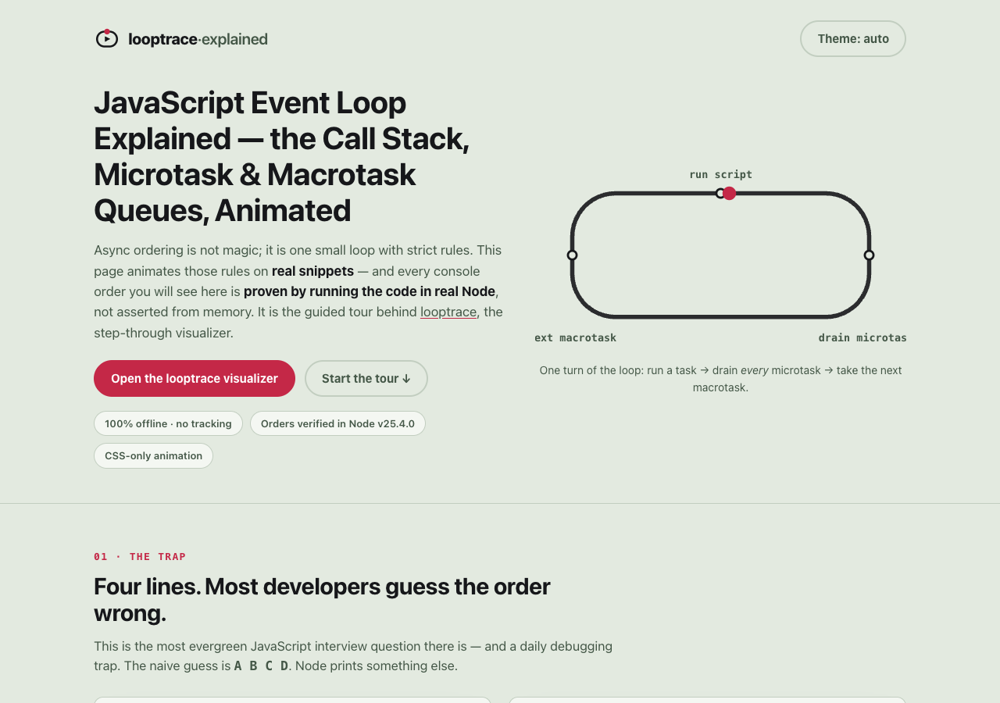

# looptrace explained — how the JavaScript event loop actually orders your code

**An animated, single-page walkthrough of the JavaScript event loop — the call stack,
the microtask queue and the macrotask queue — where every console order shown is
*proven* by executing the snippet in real Node, not asserted from memory. It is the
guided tour behind [looptrace](https://sreenivas-sadhu-prabhakara.github.io/looptrace/),
the step-through visualizer.**



- **This explainer:** https://sreenivas-sadhu-prabhakara.github.io/looptrace-explained/
- **The live app it explains:** https://sreenivas-sadhu-prabhakara.github.io/looptrace/
  ([app source](https://github.com/Sreenivas-Sadhu-Prabhakara/looptrace))

## What's on the page

- **The interview trap** — the classic `console.log`, `setTimeout(…, 0)`,
  `Promise.then`, `console.log` snippet, and why the naive `A B C D` guess is wrong.
- **An animated racetrack of the loop** — a single red tick advances through *run the
  current script → drain every microtask → take one macrotask*, drawn as a loop with
  bars and a moving dot that plays as you scroll (pure CSS + inline SVG, no libraries).
- **Three proven demos** — the classic interleave (`A D C B`), why `await` *suspends*
  rather than blocks (`1 3 2`), and how microtasks drain fully, even ones queued
  mid-drain (`p1 p2 t1 t2`). Each shows its exact code and its exact, real-Node output.
- **The enforced-privacy section** — the page ships a strict Content-Security-Policy
  with `connect-src 'none'`: the browser itself blocks any send. It is policy, not promise.
- **FAQ** — microtask vs macrotask, why `setTimeout(fn, 0)` loses to `Promise.then`,
  and a plain statement that these orders are executed, not remembered.

`prefers-reduced-motion` collapses every animation to its final, fully legible state.
Light and dark themes are both WCAG-AA; everything is keyboard-operable.

## How the animation works

There is no animation library and no `requestAnimationFrame` loop. Every scene is
driven by CSS keyframes and custom properties; `app.js` does only three things: it runs
the theme toggle (persisted in `localStorage`), it adds `.is-playing` to each scene when
it scrolls into view via `IntersectionObserver`, and it wires the ↺ replay buttons. When
`prefers-reduced-motion: reduce` is set, no scene is ever started — each stays in its
static final state. No network call is possible; `connect-src 'none'` forbids it.

## Quickstart

No build step, no dependencies.

```sh
git clone https://github.com/Sreenivas-Sadhu-Prabhakara/looptrace-explained.git
cd looptrace-explained
open index.html        # or serve statically: python3 -m http.server 8000
```

Run the self-tests (Node 20+):

```sh
node --test
```

The tests are the honesty gate. Every demo snippet in `data/facts.js` is executed
verbatim in a real Node child process, and the captured `console` output must equal the
stored order exactly — the same orders (`A D C B`, `1 3 2`, `p1 p2 t1 t2`) and the same
verbatim code that `index.html` displays. If the language, your Node version, or an edit
ever changed a result, the test would fail rather than let the page drift from the truth.
The verified run on this build was **Node v25.4.0**, on **2026-07-23**.

## Privacy

Same guarantee as the app it explains: this page ships a strict Content-Security-Policy
with `connect-src 'none'`, so **the browser itself blocks every network request**. No
server, no account, no analytics, no external fonts or scripts. The only thing stored is
your theme choice, in this browser's `localStorage`.

## Disclaimer

This explainer is an educational aid provided **"as is"**, without warranty of any kind.
The proven console orders describe the behaviour of the specific runtime they were
executed in (Node v25.4.0); other engines and future versions follow the same
HTML/ECMAScript event-loop rules but you should verify anything load-bearing in your own
target. Nothing here is professional advice. The author accepts no liability for
decisions made using this material.

## License

[MIT](LICENSE) © 2026 Sreenivas Sadhu Prabhakara
